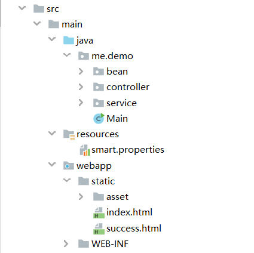
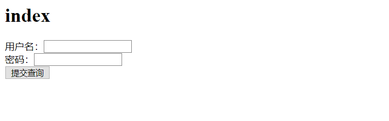
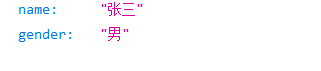

If you want to learn more about this project, visit this [blog](http://blog.crwenassert.me/archives/1584803446360)

If you want to test my demo, you should download both the smart and demo project,because the demo depends on smart

```xml
        <dependency>
            <groupId>me.crw.smart</groupId>
            <artifactId>smart</artifactId>
            <version>1.0-SNAPSHOT</version>
        </dependency>
```


Notice the demo structure




create  a properties named `smart.properties`

```pr
# 项目基础包名
smart.base_package = me.demo
```


create classes like this: 

```java
public class Person {

    String name;

    String gender;
	
    // getter/setter...
    // toString()...
}

@Service
public class PersonService {

    public void find() {
        Person person = new Person();
        person.setGender("male");
        person.setName("张三");
        System.out.println("find a person, " + person);
    }
}
```


Then, you can have a test.

```java
@Controller
public class Main {
    @Inject
    private static PersonService personService;

    public static void main(String[] args) {
        ApplicationContext context = new ApplicationContext(Main.class);
        personService.find();
    }
}
```

You can get results like this: 

> find a person, Person{name='张三', gender='male'}


Further testing......


```java
@Controller
public class PersonController {

    @Inject
    private PersonService personService;

    @Get("/")
    public String index() {
        return "index.html";
    }

    @Get("/response")
    public void testResponse(Map<String, Object> map) throws IOException {
        HttpServletRequest request = (HttpServletRequest) map.get("HttpServletRequest");
        HttpServletResponse response = (HttpServletResponse) map.get("HttpServletResponse");

        response.getWriter().write("When you see this word, you are 成功！！！");
    }

    @Post("/view")
    public String testView(Map<String, Object> map) {
        Object username = map.get("username");
        Object password = map.get("password");
        System.out.println(username);
        System.out.println(password);

        return "success.html";
    }

    @Get("/data")
    public Person testGetData() {
        Person person = new Person();
        person.setName("张三");
        person.setGender("男");
        return person;
    }

    @Post("/data")
    public Person testPostData() {
        Person person = new Person();
        person.setName("张三");
        person.setGender("男");
        return person;
    }

}

```


When you start your server, you will visit the view, if using the `index.html` we provide



When you click the submit, you will forward to the page `success.html`. Also, in console, you will see your submit.


When you start a get request `/`response, you will get the response, just like you use in servlet


When you start a get request `/`data, you will get the data




**Note** the arguments in method of Controller only can be `Map<String, Object>` or void . After all, it's only to test my ioc.（同时也是因为我比较菜）